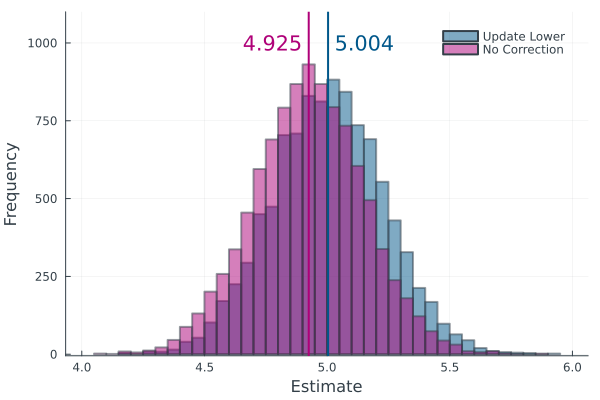

<!-- 🚧 This page is under construction 🚧 -->

<!-- <p align = "center">
    
<\p> -->

## Introduction

In practice, we often come across unusual observations in a sample. Robust statistics offers great tools to ignore or limit the influence of such observations on an estimate. This project deals with a famous class of robust estimators: M-estimators. Although initially developed for location estimation without distributional assumption, we limit to the case where a distribution is assumed and especially focus on the case of skewed or in more general terms asymmetric distributions. Standard M-estimation techniques frequently yield biased estimates that need to be corrected. In the following, I am going to give you an overview of a Julia package that was developed to fit distributions to i.i.d. samples using M-estimators. Two bias correction approaches are included: an established method and a novel appraoch.

To describe the bias corrections, let us consider a simple random sample $X_1, ..., X_n$. The expectation of $X_i$ can be estimated by minimizing
$$
    \sum_{i = 1}^n \rho\left(\frac{X_i - \mu}{\sigma}\right)
$$with respect to $\mu$, where $\sigma$ is the known or robustly estimated standard deviation of $X_i$. The function $\rho$ is a general loss function that attains its minimum at zero. Taking the derivative transforms the optimiztsation problem into the estimation equation
$$
    \sum_{i = 1}^n \psi\left(\frac{X_i - \mu}{\sigma}\right) = 0
$$where $\psi$ is the derivative of $\rho$. Whenever $\psi$ is bounded in absolute value, the resulting estimator is robust. Inserting $w(z) = \psi(z)/z$, we can further rewrite the estimation equation as fixed point equation
$$
    \mu = \frac{\sum_{i = 1}^n w(Z_i)X_i}{\sum_{i = 1}^n w(Z_i)}
$$with $Z_i = \frac{X_i - \mu}{\sigma}$. In robust statistics, we typically select a loss function that depends on the choice of a tuning constant that controls the trade-off between robustness and efficiency.

<details>
    <summary><font size = "+2"> Established Bias Correction</font></summary>
Popular choices of the loss function are symmetric, which means that deviations from the mean $\mu$ to both sides are considered equally "bad". However, for skewed distributions deviations to one side are more likely than dewviations to the other side, which causes a bias. Mathematically, we find a bias whenever

$$
    \operatorname{E}_0\left(\psi\left(\frac{X_i - \mu}{\sigma}\right)\right) \ne 0
$$where the expectation is taken with respect to true parameters $\theta_0$. The established correction approach simply subtracts a correction constant
$$
    c_\theta = \operatorname{E}_\theta\left(\psi\left(\frac{X_i - \mu}{\sigma}\right)\right)
$$in the estimation equation, i.e.
$$
    \sum_{i = 1}^n \psi\left(\frac{X_i - \mu}{\sigma}\right) - c_\theta = 0\text{ .}
$$To clarify, let us assume that $X_i \sim \text{Pois}(\lambda)$. Then, the estimation equation becomes
$$
    \sum_{i = 1}^n \psi\left(\frac{X_i - \lambda}{\sqrt{\lambda}}\right) - c_\lambda = 0\text{ .}
$$To avoid repeated compuatation of $c_\lambda$ and to gain numerical stability, the estimation equation can be solved iteratively by keeping $c_\lambda$ and the standard deviation $\sqrt{\lambda}$ constant from the previous iteration.

In this example, the expectation coincides with the parameter. If we want to fit a distribution that does not have this property, we have two esitmation options. Let $X_i$ now follow a Geometric distribution, such that $\operatorname{E}(X_i) = \frac{1 - p}{p}$. For notational brevity, let $\mu(p)$ be the expectation and $\sigma(p)$ the standard deviation of the Geometric distribution. Then, we have
$$
    \sum_{i = 1}^n \psi\left(\frac{X_i - \mu(p)}{\sigma(p)}\right) - c_p = 0\text{ .}
$$and can solve for $p$ directly. We will refer to the approach as the "direct approach". Alternatively, we can solve for $\mu(p)$ and translate the mean to a parameter estimate for $p$, which we will call the "moment based approach".

Both example distributions are parametrized by one parameter. If we want to fit a distribution with a parameter vector $\theta\in\mathbb{R}^p$, we can extend the estimation equation to higher powers of $X_i$, i.e. $X_i$, $X_i^2$, ... $X_i^p$. The $p$ estimation equations then become
$$
    \sum_{i = 1}^n \sum_{i = 1}^n \psi\left(\frac{X_i^j - \mu_j(\theta)}{\sigma_j(\theta)}\right) - c_{\theta, j} = 0
$$for $j = 1, ..., p$ where $\mu_j(\theta)$ is the expectation of $X_i^j$ and $\sigma_j(\theta)$ its standard deviation. The choice of the function $\psi$ and its tuning constant may be selected differently for the single estimation equations.
</details>


<details>
    <summary><font size = "+2"> Novel Bias Correction</font></summary>

Instead of using symmetric functions $\rho$, $\psi$ or $w$, and including a correction term, we can use asymmetric functions. The bias is tackled similarly as in the established approach by making the estimation equation zero for true parameters. The idea is to use different tuning constants for deviations to the two sides. To clarify, we simply use one tuning constant for observations that are greater that the mean (upper tuning constant) and another tuning constant for observations smaller that the mean (lower tuning constant). Keeping one of them fixed, we select the other tuning constant accordingly. In the case of one-parameter distributions, we solve
$$
    \operatorname{E}\left(\psi\left(\frac{X_i - \mu(\theta)}{\sigma(\theta)}\right)\right) = 0
$$either for the lower tuning constant keeping the upper tuning constant or vice versa. For distributions with more than one parameter, we again simply set up multiple estimation equations considering the powers $X_i$, X_i^2$, ..., $X_i^p$.
</details>

<details>
    <summary><font size = "+2"> The RobustMFit.jl Package</font></summary>

Let us now take a look at the Julia package that offers M-estimation of (almost) any distribution. The goal of the package was to provide the methods in a user-friendly way, such that parameters of any distribution can be estimated with any choice of loss function.

The package is available on my [GitHub repository](https://github.com/ManuelStapper/RobustMFit.jl) and the general Julia package repository. It can be installed and activated by running
```julia
using Pkg
Pkg.add("RobustMFit")
using RobustMFit
```
Also activating the Distributions.jl package lets us now sample from a distribution, say the Poisson
```julia
d = Poisson(10)
x = rand(d, 100)
```
and then estimate the parameter by
```julia
Mfit(x, d, Huber(1.345))
```
The three arguments are `x`, the sample, `d`, the distribution we'd like to fit, where the parameters chosen are used as initial values for the estimation and `Huber(1.345)` specifies the type of functions we select. Here we use Huber's functions with tuning constant 1.345. 
Currently, four types of functions are implemented in the package: Huber, Tukey, Andrew and Hampel.

By default, the function carries out the moment based approach solving the $\psi$-function estimation equation. It is accounted for a potential bias by keeping the upper tuning constant fixed and updating the lower tuning constant in iterations. If we choose to change the estimation settings, we can change the keyword arguments `type`, `MM` and `biasCorr`. For example
```julia
Mfit(x, d, Huber(1.345), type = :ρ, MM = false, biasCorr = :L)
```
The argument `type` can be either `:ρ`, `:ψ` or `:w`, where each can be put in either as symbol or as string `"ρ"`, `"ψ"` and `"w"`. The boolean argument `MM` is set to `false` for the direct estimation approach and to `true` for the moment based approach. The bias correction technique is either `:C` for the correction term, `:L` and `:U` for asymmetric estimation functions, where `:L` indicates that the lower tuning constant shall be updated, or as `:N` for no correction.

The asymptotic variance can then be computed and the relative asymptotic efficiency (compared to ML estimation) by
```julia
est = Mfit(x, d, Huber(1.345), type = :ρ, MM = false, biasCorr = :L)
AVar(Poisson(est), Huber(1.345), :L)
RAE(Poisson(est), Huber(1.345), :L)
```

More details on what happens in the background during estimation will follow soon
</details>